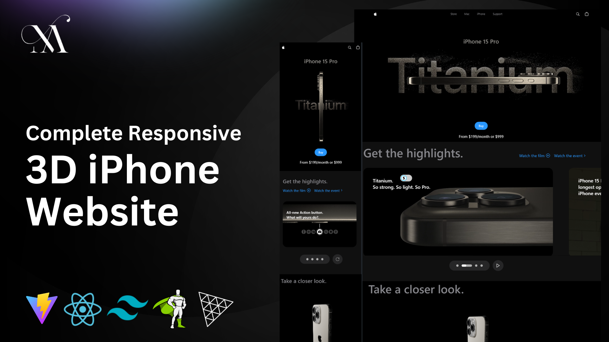

# Building a Complete Responsive 3D Apple Website Using React JS, Tailwind CSS, GSAP and Three JS

## <a name="tech-stack">⚙️ Tech Stack</a>

- React.js
- Three.js
- React Three Fiber
- React Three Drei
- GSAP (Greensock)
- Vite
- Tailwind CSS

## <a name="features">🔋 Features</a>

- **Beautiful Subtle Smooth Animations using GSAP**: Enhanced user experience with seamless and captivating animations powered by GSAP.

- **3D Model Rendering with Different Colors and Sizes**: Explore the iPhone 15 Pro from every angle with dynamic 3D rendering, offering various color and size options.

- **Custom Video Carousel (made with GSAP)**: Engage users with a unique and interactive video carousel developed using GSAP for a personalized browsing experience.

- **Completely Responsive**: Consistent access and optimal viewing on any device with a fully responsive design that adapts to different screen sizes.
